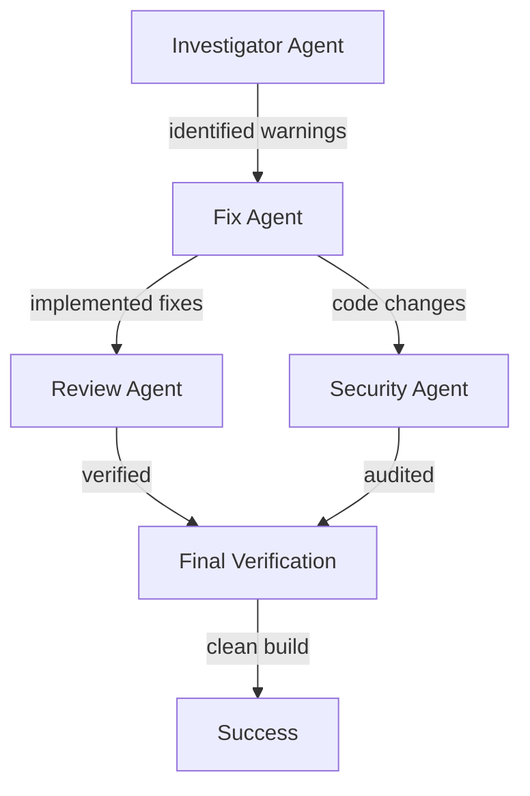

# Requirements

### Overview & Goals
The goal of this task is to improve the build quality and maintainability of the kUML project by addressing "easy-to-fix" warnings that appear during the build process. This includes Gradle build script deprecations and Kotlin compiler warnings.

### Scope
- **In Scope**:
    - Gradle deprecation warnings (e.g., `project(path = ...)` notation).
    - Kotlin compiler warnings (unused imports, variables, deprecated APIs).
    - Basic security audit of dependencies and code.
    - Final build verification with `clean build`.
- **Out of Scope**:
    - Complex refactorings that change architectural patterns.
    - Fixing warnings in third-party dependencies that are out of our control.
    - Resolving major TODOs that require significant business logic changes.

# Technical Design

### Current Implementation
The project currently uses Gradle 9.6.1 and Kotlin 2.4.0. The build output shows several deprecation warnings, particularly in `kuml-cli/build.gradle.kts` where project dependencies are declared using the `project(path = ...)` notation.

### Key Decisions
- **Multi-Agent Approach (recommended)**: Use specialized sub-agents for investigation, implementation, review, and security audit. This ensures a thorough and modular approach to resolving warnings.
- **Model Choice**: Use **Claude 3.5 Sonnet** for all stages as it provides high accuracy in both Kotlin/Gradle coding and detailed analysis.

### Proposed Changes
1.  **Gradle Notation Update**:
    - Change `implementation(project(path = ":module"))` to `implementation(project(":module"))` in all `build.gradle.kts` files.
2.  **Kotlin Code Cleanup**:
    - Remove unused imports and variables across the project.
    - Update calls to deprecated APIs where a trivial replacement is available.
3.  **Security Audit**:
    - Audit `libs.versions.toml` for outdated or potentially vulnerable libraries.
    - Verify that no sensitive data is present in the codebase.

### Architecture Diagram

# Testing

### Validation Approach
Verification will be performed by running a full project build using Gradle.

### Key Scenarios
- **Full Build**: Running `./gradlew clean build` should complete without the previously identified fixable warnings.
- **Incremental Build**: Ensure that fixes do not break Gradle's configuration caching or incremental build capabilities.
- **CLI Functionality**: A smoke test of the `kuml-cli` (e.g., `render` command) ensures that the dependency notation changes didn't affect the runtime.
- **AI Tools Verification**: Run tests in `kuml-ai-tools` (e.g., `CodeGenAiToolsTest.kt`) to ensure no regression in the AI integration.

### Edge Cases
- **Multiplatform Modules**: Ensure changes in `kuml-desktop` or other multi-platform modules don't break specific target builds.
- **Dynamic Loading**: Verify that the `runCatching` block for `AiCommand` in `KumlCli` still works correctly after any potential cleanup.

# Delivery Steps

###   Step 1: Investigate and categorize all warnings (Investigator Agent)
All warnings are identified and categorized.

- Run `./gradlew clean build --warning-mode all` to capture all build and compiler warnings.
- Parse the output to identify Gradle deprecations, Kotlin compiler warnings (e.g., unused imports, deprecated APIs), and potential ktlint violations.
- Document the findings for the fixing stage.

###   Step 2: Fix Gradle deprecation warnings (Fix Agent)
Gradle build scripts use the recommended dependency notation.

- Search all `build.gradle.kts` files for the deprecated `project(path = ...)` notation.
- Replace them with the modern `project(...)` notation to resolve Gradle 10 compatibility warnings.
- Address any other Gradle configuration warnings found in the investigation stage.

###   Step 3: Fix Kotlin compiler warnings (Fix Agent)
Source code is free of easy-to-fix Kotlin compiler warnings.

- Remove unused imports across all modules.
- Address simple Kotlin warnings such as unused variables, unnecessary explicit types, or trivial deprecations.
- Ensure that `explicitApi()` requirements are met where applicable.

###   Step 4: Implementation Review and Security Audit (Review & Security Agents)
A security check of the project's dependencies and critical code paths is completed.

- Verify dependency versions in `libs.versions.toml` against known vulnerabilities (basic check).
- Inspect code for hardcoded secrets or sensitive information.
- Review the dynamic command loading logic in `KumlCli` for security best practices.

###   Step 5: Final Build Verification (Verification Agent)
The project builds successfully without fixable warnings.

- Execute `./gradlew clean build` to verify the project's state.
- Ensure that all addressed warnings are gone and no new issues were introduced.
- Run AI-specific tests in `kuml-ai-tools` as a regression check.