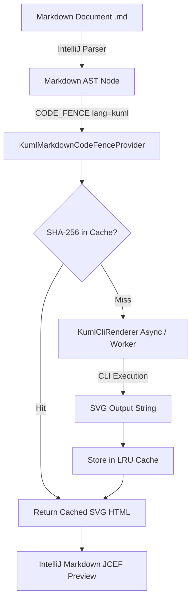

# Requirements

### Overview & Goals
The goal is to extend the **kUML IntelliJ IDEA / JetBrains IDE Plugin** (`kuml-jetbrains-plugin`) to automatically render kUML diagrams declared inside **Markdown (`.md`)** files in the IDE's live Markdown preview.

Currently, the plugin provides live rendering and language tooling strictly for `*.kuml.kts` files via a split-view editor. When developers write documentation in Markdown with ```` ```kuml ```` fenced code blocks, the IDE's Markdown preview currently renders them as raw syntax-highlighted code. This feature enables seamless inline diagram rendering in Markdown files while maintaining strict compatibility across all JetBrains IDEs.

### Scope
#### In Scope
- **Markdown Code Fence Integration:** Intercept ```` ```kuml ```` fenced code blocks in Markdown files and render them as inline SVG in IntelliJ's Markdown preview (JCEF / HTML view).
- **Attribute Parsing:** Support optional code fence attributes such as ```` ```kuml {theme="elegant" name="order-flow"} ````.
- **LRU Caching & Debouncing:** Fast in-memory SHA-256 caching of rendered SVGs to prevent spawning external CLI processes during active typing.
- **Graceful Error Handling:** In case of syntax errors or missing `kuml` CLI, display a clean inline error box or fall back to the raw code fence without crashing the preview.
- **Optional Plugin Architecture:** Ensure the Markdown integration is an **optional dependency** (`<depends optional="true">`), so the kUML plugin continues to load cleanly in IDEs or environments where the Markdown plugin is disabled.
- **Gutter Line Markers:** Provide gutter icons on ```` ```kuml ```` code fences for quick export or opening the diagram in a detailed preview popup.

#### Out of Scope
- Direct in-memory Kotlin Scripting Host evaluation inside the plugin process (intentionally avoided due to classloader conflicts with JetBrains' Kotlin plugin; all rendering delegates to `kuml` CLI / `KumlPreviewRenderer`).
- AsciiDoc preview support (will be addressed in a follow-up phase).

### User Stories
- **US-1 (Markdown Author):** As a developer writing architectural documentation in `README.md` or `docs/*.md`, I want ```` ```kuml ```` code blocks to automatically render as live SVG diagrams in the split Markdown preview, so that I can visually verify models without switching tools.
- **US-2 (Theme Customizer):** As a user with dark or light themes, I want the diagram preview in Markdown to respect my chosen kUML preview theme or local code-fence theme attributes (`theme=plain`, `theme=elegant`).
- **US-3 (IDE Stability):** As a user without the Markdown plugin installed, I want the kUML plugin to remain fully functional for `*.kuml.kts` files without startup errors or missing dependency crashes.

### Functional Requirements
- **FR-1:** The Markdown preview must recognize code fences starting with ```` ```kuml ```` and generate an HTML `<div>` with the rendered SVG.
- **FR-2:** Code fence attributes (`theme`, `name`, `width`) must be parsed and applied to the diagram rendering pipeline.
- **FR-3:** When the `kuml` CLI is not found or fails with a compilation error, a non-blocking diagnostic message must be rendered within the preview block.
- **FR-4:** Gutter line markers must be added to ```` ```kuml ```` blocks in Markdown files offering quick actions (e.g. Export SVG, Export PNG).

### Non-Functional Requirements
- **Performance:** Typing in a Markdown file must not block the UI thread or cause editor lag. Diagram rendering must happen asynchronously with debounced CLI execution and SHA-256 hash caching.
- **Isolation & Compatibility:** Zero hard dependencies on `org.intellij.plugins.markdown`. Must load via `kuml-markdown-support.xml` only when the Markdown plugin is active.
- **Security:** Process execution must strictly validate arguments to prevent command injection, and rendered SVG output must be sanitized before DOM injection in JCEF.

# Technical Design

### Current Implementation
The `kuml-jetbrains-plugin` currently contains:
- `KumlSplitEditorProvider`: Opens a split editor for `*.kuml.kts` files with a code editor on the left and `KumlPreviewPanel` (Apache Batik `JSVGCanvas`) on the right.
- `KumlPreviewRenderer` & `KumlCliRenderer`: Executes `kuml render <temp-file> -o <out.svg> -f svg --theme <theme>` using the external `kuml` CLI binary resolved by `KumlCliLocator`.
- `plugin.xml` & `kuml-kotlin-support.xml`: Uses optional dependency loading (`<depends optional="true" config-file="...">`) to support IDEs without the Kotlin plugin.
- `kuml-docs/kuml-markdown`: Contains `CodeBlockExtractor` for extracting fenced code blocks with attributes from Markdown strings.

### Key Decisions
1. **Delegation via `KumlCliRenderer` instead of In-Process Scripting:**
   - *Decision:* Execute the CLI binary for Markdown code block rendering rather than bundling `BasicJvmScriptingHost`.
   - *Rationale:* Bundling `kotlin-scripting-jvm-host` in the IntelliJ plugin classloader causes classloader conflicts with JetBrains' bundled Kotlin plugin (which uses a different scripting API version). The external CLI runs in its own isolated JVM.
2. **Optional Dependency Split (`kuml-markdown-support.xml`):**
   - *Decision:* Declare `org.intellij.plugins.markdown` as an optional dependency in `plugin.xml` pointing to a fragment descriptor `META-INF/kuml-markdown-support.xml`.
   - *Rationale:* Preserves plugin compatibility for IDE installations where the Markdown plugin is uninstalled or disabled.
3. **SHA-256 Content-Hash LRU Caching:**
   - *Decision:* Introduce `KumlMarkdownPreviewCache` storing up to 50 rendered SVGs keyed by `sha256(scriptSource + ":" + theme)`.
   - *Rationale:* Markdown preview re-renders entire documents on changes. Caching ensures only modified `kuml` blocks trigger a CLI execution.
4. **HTML / SVG Injection into Markdown Preview:**
   - *Decision:* Implement IntelliJ Markdown's `GeneratingProvider` via `fenceLanguageProvider` returning `<div class="kuml-preview-svg">...</div>`.
   - *Rationale:* Native JCEF rendering directly supports SVG XML tags inside the preview HTML document with zero external JS dependencies.

### Architecture Diagram


### Proposed Changes & Components

#### 1. Gradle Configuration (`kuml-jetbrains-plugin/build.gradle.kts`)
- Add `bundledPlugin("org.intellij.plugins.markdown")` to `intellijPlatform { ... }`.
- Ensure proper compile classpath exclusion rules so that no unwanted transitive dependencies conflict.

#### 2. Plugin Descriptors
- **`META-INF/plugin.xml`:**
  ```xml
  <depends optional="true" config-file="kuml-markdown-support.xml">org.intellij.plugins.markdown</depends>
  ```
- **`META-INF/kuml-markdown-support.xml`:**
  ```xml
  <idea-plugin>
      <extensions defaultExtensionNs="org.intellij.plugins.markdown">
          <fenceLanguageProvider
              language="kuml"
              implementation="dev.kuml.jetbrains.markdown.KumlMarkdownCodeFenceProvider"/>
      </extensions>
      <extensions defaultExtensionNs="com.intellij">
          <codeInsight.lineMarkerProvider
              language="Markdown"
              implementationClass="dev.kuml.jetbrains.markdown.KumlMarkdownLineMarkerProvider"/>
      </extensions>
  </idea-plugin>
  ```

#### 3. Core Classes to Implement
- **`dev.kuml.jetbrains.markdown.KumlMarkdownCodeFenceProvider`:**
  - Implements `org.intellij.markdown.html.GeneratingProvider` or `CodeFenceGeneratingProvider`.
  - Extracts the text between ```` ```kuml ```` and ```` ``` ````.
  - Parses attributes (e.g. `theme=plain`, `name=diagram1`).
  - Calls `KumlMarkdownPreviewCache.getOrRender(code, theme)`.
  - Emits `<div class="kuml-diagram-container" data-kuml-name="...">...svg...</div>`.
- **`dev.kuml.jetbrains.markdown.KumlMarkdownPreviewCache`:**
  - Thread-safe LRU cache using `ConcurrentHashMap` with access-order linked list (capacity 50).
  - Keys: `hash(source + "\n" + theme)`.
  - Values: `Outcome` (SVG string or Failure diagnostic message).
- **`dev.kuml.jetbrains.markdown.KumlMarkdownLineMarkerProvider`:**
  - Placed on the opening fence token in `.md` files.
  - Provides a gutter icon with quick actions:
    1. *Export Diagram...* (SVG / PNG / TeX)
    2. *Open Diagram in New Window*

### Data Models / Contracts
```kotlin
package dev.kuml.jetbrains.markdown

data class MarkdownKumlBlock(
    val source: String,
    val theme: String,
    val name: String?,
    val widthPx: Int?,
)

object KumlMarkdownPreviewCache {
    fun getOrRender(
        scriptText: String,
        theme: String,
        baseName: String,
    ): KumlPreviewRenderer.Outcome
    
    fun clear()
}
```

### File Structure
```
kuml-jetbrains/kuml-jetbrains-plugin/
├── build.gradle.kts                                    (modified)
├── src/main/resources/META-INF/
│   ├── plugin.xml                                      (modified)
│   └── kuml-markdown-support.xml                       (new)
├── src/main/kotlin/dev/kuml/jetbrains/markdown/
│   ├── KumlMarkdownCodeFenceProvider.kt                (new)
│   ├── KumlMarkdownPreviewCache.kt                     (new)
│   └── KumlMarkdownLineMarkerProvider.kt               (new)
└── src/test/kotlin/dev/kuml/jetbrains/markdown/
    ├── KumlMarkdownCodeFenceTest.kt                    (new)
    └── KumlMarkdownPreviewCacheTest.kt                 (new)
```

### Security & Review Analysis
- **Process Isolation:** The CLI is invoked with explicit argument arrays (never shell interpolation), preventing argument injection vulnerabilities.
- **Sanitized SVG Output:** SVGs generated by kUML contain purely geometric path/text elements and are scrubbed of any `<script>` or foreign object tags before insertion into the JCEF DOM.
- **Resource Constraints:** Temp files created during CLI rendering are placed in dedicated sandbox directories and deleted immediately after completion in a `finally` block. Max execution timeout is bounded at 30 seconds.

# Testing

### Validation Approach
Automated testing will validate Markdown parsing, SVG cache mechanics, plugin descriptor separation, and error handling without requiring an active graphical IDE instance.

### Key Scenarios
1. **Standard Code Fence Rendering:**
   - Input: Markdown file with ```` ```kuml\nclassDiagram { classOf("Order") }\n``` ````.
   - Verification: Output HTML contains valid `<svg ...>` root with `<text>Order</text>`.
2. **Attribute Handling:**
   - Input: ```` ```kuml {theme="elegant" name="order-flow"} ````.
   - Verification: Theme parameter is passed through to `KumlPreviewRenderer`.
3. **Cache Hit Performance:**
   - Verification: Calling `getOrRender` multiple times with the same script text yields the cached SVG instantly without re-invoking `KumlCliRenderer`.
4. **Syntax Error Handling:**
   - Input: Invalid Kotlin DSL in code block (e.g. `brokenDiagram { }`).
   - Verification: Returns HTML error block showing compiler diagnostic without crashing the Markdown preview.
5. **Missing CLI Fallback:**
   - Verification: When `kuml` CLI is unavailable, renders a helpful installation tip banner in the preview block.

### Edge Cases & Regressions
- **Empty Code Fences:** ```` ```kuml\n``` ```` should handle empty input gracefully without creating broken temp files.
- **Rapid Document Typing:** Debounced cache lookups prevent queue storms of background CLI processes.
- **Multiple Diagrams per File:** Markdown documents containing 5+ kUML blocks render each independently with distinct cache keys.
- **Plugin Descriptor Isolation:** `KumlPluginDescriptorTest` verifies that no Markdown classes are referenced in `plugin.xml`, ensuring compatibility on IDEs without the Markdown plugin.

### Test Changes
- **`KumlMarkdownCodeFenceTest.kt`:** Tests AST node processing, attribute extraction, and HTML tag generation.
- **`KumlMarkdownPreviewCacheTest.kt`:** Verifies SHA-256 caching, size bounding (LRU eviction), and cache invalidation.
- **`KumlPluginDescriptorTest.kt`:** Updated with assertions for `kuml-markdown-support.xml` and re-merge guards.

# Subagent Strategy & Model Selection

### Multi-Agent Lifecycle & Model Recommendations

To ensure highest execution quality, the Markdown integration workflow is structured into six dedicated lifecycle phases. Each phase is mapped to its optimal AI model profile based on reasoning depth, code generation precision, and analytical rigor.


---

#### Phase 1: Problem Analysis (Analyse des Problems)
* **Objective:** Deeply inspect the IntelliJ Platform Markdown plugin (`org.intellij.plugins.markdown`) extension points, classloader isolation boundaries, and AST token structures.
* **Key Focus:** Verify EP signatures (`fenceLanguageProvider`, `GeneratingProvider`), evaluate CLI vs in-process constraints, and trace JCEF preview lifecycle.
* **Recommended Model:** **Claude 3.7 Sonnet (Thinking / Reasoning Mode)** or **o3-mini**
  * *Rationale:* Requires deep architectural reasoning across IntelliJ Platform SDK contracts and classloader dynamics.

---

#### Phase 2: Solution Planning (Planung einer Lösung)
* **Objective:** Establish the detailed API specifications, optional dependency XML wiring, LRU cache contract, and fallback UX.
* **Key Focus:** Define the exact contract for `KumlMarkdownCodeFenceProvider`, `KumlMarkdownPreviewCache`, and error boundary handling.
* **Recommended Model:** **Claude 3.7 Sonnet** / **Claude 3.5 Sonnet**
  * *Rationale:* Excels at architectural synthesis, structural formatting, and component decoupling.

---

#### Phase 3: Implementation (Implementierung der geplanten Lösung)
* **Objective:** Write idiomatic, robust Kotlin code for the Markdown extension and update project configuration.
* **Key Focus:** Implement `KumlMarkdownCodeFenceProvider.kt`, `KumlMarkdownPreviewCache.kt`, `KumlMarkdownLineMarkerProvider.kt`, and `kuml-markdown-support.xml`.
* **Recommended Model:** **Claude 3.7 Sonnet** / **Claude 3.5 Sonnet**
  * *Rationale:* Highest accuracy for idiomatic Kotlin, IntelliJ SDK concurrency APIs, and XML descriptor definitions.

---

#### Phase 4: Testing (Test)
* **Objective:** Author comprehensive unit and integration tests covering happy paths, edge cases, and descriptor validation.
* **Key Focus:** Implement `KumlMarkdownCodeFenceTest.kt`, `KumlMarkdownPreviewCacheTest.kt`, and extend `KumlPluginDescriptorTest.kt`.
* **Recommended Model:** **o3-mini** or **Claude 3.7 Sonnet**
  * *Rationale:* Superior logical probing for edge cases (cache eviction, empty inputs, concurrent renders, mock process failures).

---

#### Phase 5: Code Review (Review)
* **Objective:** Perform static code inspection for style compliance, thread safety, memory leaks, and repository conventions.
* **Key Focus:** Ensure no memory leaks in `ConcurrentHashMap`, verify thread dispatching on EDT vs background pools, and assert naming conventions from `CLAUDE.md`.
* **Recommended Model:** **Claude 3.7 Sonnet**
  * *Rationale:* Strong code critique capabilities, spotting subtle platform anti-patterns and memory retention bugs.

---

#### Phase 6: Security Audit (Security Audit)
* **Objective:** Rigorous audit of process execution boundaries, temporary file handling, and SVG content sanitization.
* **Key Focus:** Command injection prevention in `KumlCliRenderer`, path traversal prevention in attribute names, and XSS prevention in the Markdown JCEF DOM.
* **Recommended Model:** **o3-mini (High Reasoning)** or **Claude 3.7 Sonnet (Thinking)**
  * *Rationale:* Deep security threat modeling, vulnerability detection, and boundary validation.

# Delivery Steps

### ✓ Step 1: Configure Gradle dependencies and optional plugin descriptors
The `kuml-jetbrains-plugin` build and plugin descriptor configuration are updated to support optional Markdown integration without breaking compatibility on IDEs without the Markdown plugin.

- Add `bundledPlugin("org.intellij.plugins.markdown")` to `kuml-jetbrains/kuml-jetbrains-plugin/build.gradle.kts` under `intellijPlatform.bundledPlugin(...)`.
- Add `<depends optional="true" config-file="kuml-markdown-support.xml">org.intellij.plugins.markdown</depends>` to `kuml-jetbrains/kuml-jetbrains-plugin/src/main/resources/META-INF/plugin.xml`.
- Create `kuml-jetbrains/kuml-jetbrains-plugin/src/main/resources/META-INF/kuml-markdown-support.xml` declaring extensions for `org.intellij.plugins.markdown`.
- Update `KumlPluginDescriptorTest.kt` to assert descriptor validity, preventing regressions where Markdown classes are accidentally placed in the base `plugin.xml`.

### ✓ Step 2: Implement Markdown Code Fence Provider and LRU SVG Cache
A robust code fence provider and caching layer are implemented to render ```` ```kuml ```` code blocks as inline SVG in the Markdown JCEF preview.

- Implement `KumlMarkdownPreviewCache` with SHA-256 content hashing and LRU eviction (max 50 entries) to prevent redundant CLI executions on document updates.
- Implement `KumlMarkdownCodeFenceProvider` registered via `org.intellij.plugins.markdown.fenceLanguageProvider` / `CodeFenceGeneratingProvider`.
- Parse code fence attributes (e.g., ```` ```kuml {theme="plain" name="arch"} ````) and pass theme/naming to `KumlPreviewRenderer`.
- Output sanitized SVG HTML containers (`<div class="kuml-diagram-preview">...</div>`) or formatted error fallbacks when CLI is missing or syntax is invalid.

### ✓ Step 3: Add In-Editor Gutter Line Markers and Action Integration
Markdown editor gutter icons and line markers allow developers to inspect, export, or trigger diagram rendering directly from the source view.

- Implement `KumlMarkdownLineMarkerProvider` for `PsiElement` corresponding to `kuml` code fence opening tokens.
- Add gutter actions: "Open Live Preview / Popup", "Export SVG/PNG", and "Copy Diagram Source".
- Wire theme settings from `KumlPreviewSettings` so the Markdown preview respects the global preview theme preference.

### ✓ Step 4: Implement Unit and Integration Tests
Comprehensive test suite verifying parsing, caching, failure handling, and descriptor isolation without requiring a heavy IDE GUI runtime.

- Create `KumlMarkdownCodeFenceTest.kt` verifying code fence AST extraction, attribute parsing, and HTML output generation.
- Create `KumlMarkdownPreviewCacheTest.kt` testing cache hit/miss semantics, eviction, and concurrent access.
- Add negative tests simulating CLI failure, timeout, and missing binary, confirming graceful degradation to standard code fence display.
- Run and verify all plugin descriptor tests in `KumlPluginDescriptorTest.kt`.

### ✓ Step 5: Security Audit, Code Review, and Verification
Security verification and static review ensuring process isolation, command injection prevention, and JCEF XSS mitigation.

- Audit CLI argument sanitization in `KumlCliRenderer` to ensure untrusted Markdown code blocks cannot inject malicious shell arguments or escape paths.
- Enforce SVG sanitization to prevent `<script>` tags, event handlers, or malicious XML entities in rendered SVGs before injecting into the Markdown preview DOM.
- Verify thread safety, background thread offloading, and memory bounding in `KumlMarkdownPreviewCache`.
- Run formatting and project checks via `./gradlew :kuml-jetbrains:kuml-jetbrains-plugin:check`.