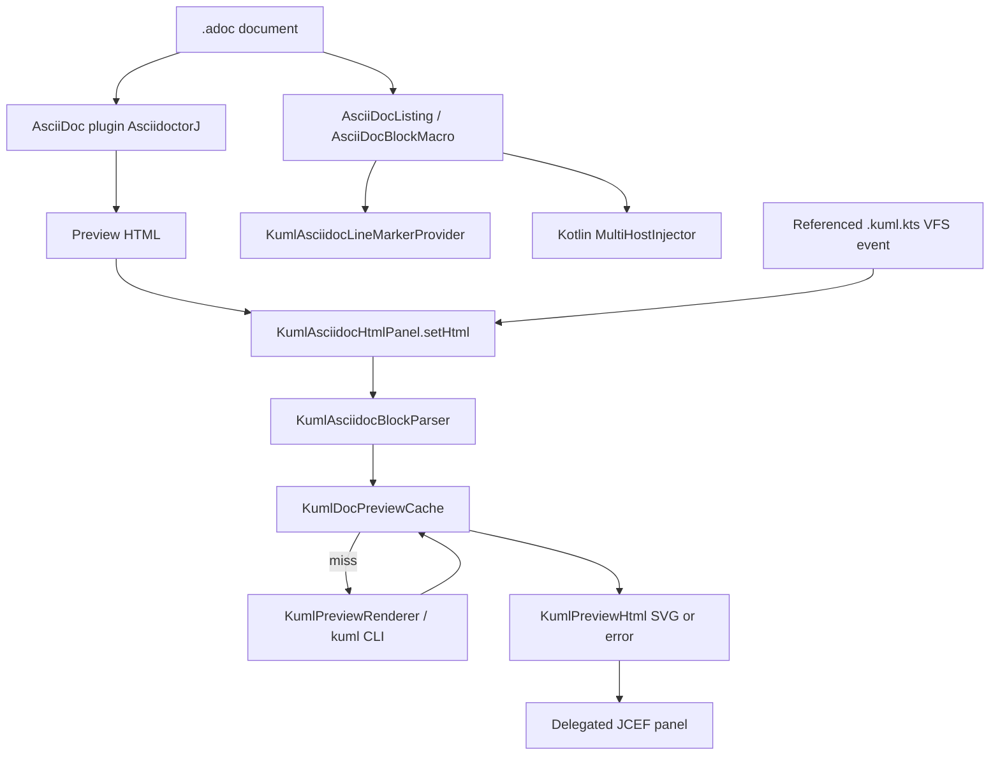
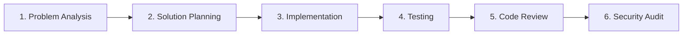

# Requirements

### Overview & Goals

Extend the **kUML JetBrains plugin** (`kuml-jetbrains-plugin`) so kUML diagrams declared in **AsciiDoc (`.adoc` / `.asciidoc`)** files render automatically as inline SVG in the official AsciiDoc plugin preview (JCEF).

Markdown support already ships (`KumlMarkdownCodeFenceProvider`, LRU cache, gutter actions). AsciiDoc cannot copy that path: plugin `org.asciidoctor.intellij.asciidoc` **0.45.6** exposes only `html.panel.provider` and `asciidocRunner` — there is no fence-generating EP. This plan hooks the preview by rewriting the HTML that AsciidoctorJ produces, while reusing the Markdown cache and HTML helpers.

### Scope

#### In Scope

- **Preview HTML rewrite** for `[source,kuml]` listing blocks and `kuml::path[]` block macros inside the official AsciiDoc JCEF preview.
- **Both AsciiDoc source forms**, matching `kuml-docs/kuml-asciidoc` / `kuml asciidoc` CLI: inline listings and external `*.kuml.kts` macros, including `theme`, `name`, `width`.
- **Shared preview cache:** extract `KumlMarkdownPreviewCache` into `KumlDocPreviewCache` so Markdown and AsciiDoc share SHA-256 / LRU-50 hits.
- **Gutter line markers** on listings and macros (Export SVG/PNG/TeX, Copy SVG, Copy Source) — same actions as Markdown.
- **Kotlin injection** in `[source,kuml]` listing bodies (parity with `KumlMarkdownCodeFenceLanguageProvider`).
- **Referenced-file refresh:** a change to a `kuml::`-targeted `*.kuml.kts` retriggers preview rewrite.
- **Optional plugin architecture:** `<depends optional="true" config-file="kuml-asciidoc-support.xml">org.asciidoctor.intellij.asciidoc</depends>` so kUML still loads without the AsciiDoc plugin.

#### Out of Scope

- Editor block inlays (explicitly not chosen).
- AsciidoctorJ `BlockProcessor` / project-level `.asciidoctor/lib` injection.
- Depending on `:kuml-docs:kuml-asciidoc` (pulls `kotlin-scripting-jvm-host`, which the plugin must not bundle).
- In-process Kotlin scripting host evaluation (same CLI-only rule as Markdown).
- Changing the Antora / `kuml asciidoc` CLI pipeline.

### User Stories

- **US-1 (AsciiDoc author):** As someone writing handbook pages in `.adoc`, I want `[source,kuml]` blocks to appear as live SVG in the AsciiDoc split preview, so I can check the diagram without running `kuml asciidoc`.
- **US-2 (External diagram):** As an author using `kuml::diagrams/order.kuml.kts[]`, I want that file rendered in the preview and updated when the script changes.
- **US-3 (Theme):** Per-block `theme=` / `name=` / `width=` and the global Settings → Tools → kUML Preview theme apply in AsciiDoc the same way they do in Markdown.
- **US-4 (IDE stability):** Without the AsciiDoc plugin, kUML still loads (file icon, split preview for `*.kuml.kts`, Markdown support).

### Functional Requirements

- **FR-1:** AsciiDoc preview HTML for `[source,kuml]` listings is replaced by a sanitized SVG container (or error/empty box).
- **FR-2:** `kuml::relative/path.kuml.kts[attrs]` resolves against the `.adoc` parent directory, reads the file, and replaces the unresolved-macro HTML with the same container.
- **FR-3:** Attributes `theme`, `name`, `width` are parsed from the listing header and the macro brackets.
- **FR-4:** Missing CLI, compile errors, missing/unreadable macro targets, and empty scripts render a non-blocking diagnostic box; the rest of the preview stays intact.
- **FR-5:** Gutter icons on listing headers and `kuml::` lines expose the same export/copy actions as Markdown.
- **FR-6:** `[source,kuml]` bodies use Kotlin highlighting when the Kotlin plugin is present.

### Non-Functional Requirements

- **Performance:** Rewrite must not storm the CLI. Shared SHA-256 LRU (50) across Markdown and AsciiDoc. First render of a large page may be synchronous (same trade-off as Markdown `generateHtml`).
- **Isolation:** No hard dependency on `org.asciidoctor.intellij.asciidoc`. No `kuml-asciidoc` / scripting-host on the plugin classpath.
- **Security:** CLI invoked with argument arrays only. SVG stripped of `<script>` and `on*` handlers before JCEF injection. Macro paths must stay inside the project (no `..` escape, no `file:` / `http:` targets).
- **Compatibility:** Compile against an AsciiDoc plugin version that matches `intellij-idea` 2024.3; use only stable PSI + `AsciiDocHtmlPanel` so runtime works on 0.43–0.45.

# Technical Design

### Current Implementation

- **Markdown (done):** `KumlMarkdownCodeFenceProvider` implements `CodeFenceGeneratingProvider`; `KumlMarkdownPreviewCache` is a Markdown-only LRU; gutter + language provider live behind `kuml-markdown-support.xml`.
- **AsciiDoc CLI (exists, not in the IDE):** `AsciidocBlockExtractor` / `AsciidocProcessor` in `kuml-docs/kuml-asciidoc` replace `[source,kuml]` and `kuml::` with `++++` SVG or `image::`. The module `api()`-depends on `kuml-core-script` and bundles the scripting host — **not usable from the plugin**.
- **AsciiDoc IntelliJ plugin 0.45.6:** public EPs are `org.asciidoc.intellij.html.panel.provider` (`AsciiDocHtmlPanelProvider`) and `asciidocRunner`. Preview HTML is built by `AsciiDocWrapper.render()` then `AsciiDocHtmlPanel.setHtml(html, attrs)`. Bundled mermaid/kroki Ruby extensions do not help kUML. PSI: `AsciiDocListing.getFenceLanguage()`, `AsciiDocBlockMacro.getMacroName()` / `getResolvedBody()`, language id `AsciiDoc`.
- **Renderer:** `KumlPreviewRenderer.renderOutcome` → external `kuml` CLI via `KumlCliRenderer` (argument array, temp files, timeout).

### Key Decisions

1. **Preview integration = HTML rewrite via wrapping `AsciiDocHtmlPanel` (user choice).**
   - Register `KumlAsciidocHtmlPanelProvider` on `org.asciidoc.intellij.html.panel.provider` with `order="first"`.
   - Do **not** subclass `AsciiDocJCEFHtmlPanel`. Look up the stock JCEF provider through `AsciiDocHtmlPanelProvider.getProviders()`, call `createHtmlPanel`, wrap the returned `AsciiDocHtmlPanel`.
   - `setHtml` runs `KumlAsciidocHtmlRewriter.rewrite(html, editorDocument.text, basePath)` then delegates.
   - If the user has pinned a non-JCEF engine, leave it; if they use the default JCEF provider, prefer ours on first run so rewrite is active without a settings trip.

2. **Shared cache (user choice).**
   - Move SHA-256 + LRU-50 into `dev.kuml.jetbrains.preview.KumlDocPreviewCache`.
   - Extract `sanitizeSvg` / `escapeHtml` / SVG-error-empty containers into `KumlPreviewHtml`.
   - Markdown call sites and tests switch to the shared types. No second LRU.

3. **Both listings and macros (user choice).**
   - Port extractor regexes into `KumlAsciidocBlockParser` (keep in sync with `AsciidocBlockExtractor`; do not depend on `:kuml-docs:kuml-asciidoc`).
   - Listings: match Asciidoctor HTML (`data-lang="kuml"`, `language-kuml`, listingblock + escaped source).
   - Macros: resolve path, read file, replace leftover `kuml::path[...]` HTML (or the matching paragraph). Failed resolution → error box, never crash `setHtml`.

4. **CLI-only rendering.** Same classloader reason as Markdown. No `BasicJvmScriptingHost`.

5. **Optional marketplace plugin, not `bundledPlugin`.** AsciiDoc is third-party. Gradle: `plugin("org.asciidoctor.intellij.asciidoc", "<2024.3-compatible version>")` next to the existing `bundledPlugin("org.intellij.plugins.markdown")`.

### Architecture Diagram



### Proposed Changes

#### 1. Shared preview kernel (Markdown refactor)

- Add `dev.kuml.jetbrains.preview.KumlDocPreviewCache` with the current `computeKey` / `getOrRender` / LRU contract.
- Add `dev.kuml.jetbrains.preview.KumlPreviewHtml` (`sanitizeSvg`, `escapeHtml`, `escapeHtmlAttribute`, `svgContainer`, `errorContainer`, `emptyContainer`).
- Point `KumlMarkdownCodeFenceProvider` and `KumlMarkdownPreviewCache` at the shared types. Keep `KumlMarkdownPreviewCache` as a thin deprecated facade **or** delete it and retarget tests — prefer delete + retarget so there is one cache.

#### 2. Gradle and descriptors

`kuml-jetbrains/kuml-jetbrains-plugin/build.gradle.kts`:

```kotlin
intellijPlatform {
    bundledPlugin("org.jetbrains.kotlin")
    bundledPlugin("org.intellij.plugins.markdown")
    plugin("org.asciidoctor.intellij.asciidoc", /* 2024.3-compatible, e.g. 0.44.x */)
}
```

`plugin.xml` — add:

```xml
<depends optional="true" config-file="kuml-asciidoc-support.xml">org.asciidoctor.intellij.asciidoc</depends>
```

New `META-INF/kuml-asciidoc-support.xml`:

```xml
<idea-plugin>
    <extensions defaultExtensionNs="org.asciidoc.intellij">
        <html.panel.provider
            implementation="dev.kuml.jetbrains.asciidoc.KumlAsciidocHtmlPanelProvider"
            order="first"/>
    </extensions>
    <extensions defaultExtensionNs="com.intellij">
        <codeInsight.lineMarkerProvider
            language="AsciiDoc"
            implementationClass="dev.kuml.jetbrains.asciidoc.KumlAsciidocLineMarkerProvider"/>
        <multiHostInjector
            implementation="dev.kuml.jetbrains.asciidoc.KumlAsciidocLanguageInjector"/>
    </extensions>
</idea-plugin>
```

No AsciiDoc class names in the base `plugin.xml`.

#### 3. AsciiDoc rewrite pipeline

- **`KumlAsciidocBlockParser`:** port `LISTING_HEADER`, `LISTING_FENCE`, `BLOCK_MACRO`, `ATTR_PAIR` from `AsciidocBlockExtractor`. Same `AsciidocKumlBlock`-shaped data class (plugin-internal).
- **`KumlAsciidocPathGuard`:** resolve macro target against the `.adoc` parent; reject empty, absolute-outside-project, `..` escaping the project content root, and `http(s):` / `file:` URIs.
- **`KumlAsciidocHtmlRewriter`:** pure function `(html, adocSource, baseDir) -> html`. For each parsed block: cache-render via `KumlDocPreviewCache`; replace the matching HTML node/snippet; on no match, leave HTML unchanged.
- **`KumlAsciidocHtmlPanel` / `KumlAsciidocHtmlPanelProvider`:** wrap stock JCEF panel; forward `render`, `scrollToLine`, `printToPdf`, `dispose`, `getComponent`, editor accessors.
- **`KumlAsciidocReferencedFileWatcher`:** remember macro targets of the open preview document; on `BulkFileListener` VFS content change, call `panel.render()`.

#### 4. Editor affordances

- **`KumlAsciidocLineMarkerProvider`:** `AsciiDocListing` whose `fenceLanguage` starts with `kuml`; `AsciiDocBlockMacro` whose `macroName` is `kuml`. Reuse `KumlExportAction` / `KumlExportFormat` / `CopyPasteManager` exactly like `KumlMarkdownLineMarkerProvider`.
- **`KumlAsciidocLanguageInjector`:** `MultiHostInjector` for `AsciiDocListing` hosts → Kotlin language when fence language is kuml (reflective Kotlin language lookup, same as Markdown).

### Data Models / Contracts

```kotlin
internal data class KumlAsciidocBlock(
    val kind: Kind, // LISTING or BLOCK_MACRO
    val source: String,      // listing body; empty for macros until file read
    val targetPath: String?, // macro path only
    val startLine: Int,
    val endLine: Int,
    val attributes: Map<String, String>,
)

internal object KumlAsciidocHtmlRewriter {
    fun rewrite(html: String, adocSource: String, baseDir: Path): String
}

internal object KumlDocPreviewCache {
    const val MAX_ENTRIES: Int = 50
    fun computeKey(scriptText: String, theme: String, name: String = ""): String
    fun getOrRender(scriptText: String, theme: String, baseName: String): KumlPreviewRenderer.Outcome
    fun clear()
}
```

### File Structure

```
kuml-jetbrains/kuml-jetbrains-plugin/
├── build.gradle.kts                                              (modified)
├── src/main/resources/META-INF/
│   ├── plugin.xml                                                (modified)
│   └── kuml-asciidoc-support.xml                                 (new)
├── src/main/kotlin/dev/kuml/jetbrains/
│   ├── preview/
│   │   ├── KumlDocPreviewCache.kt                                (new, from Markdown cache)
│   │   └── KumlPreviewHtml.kt                                    (new, from Markdown HTML helpers)
│   ├── markdown/
│   │   ├── KumlMarkdownPreviewCache.kt                           (deleted or facade)
│   │   └── KumlMarkdownCodeFenceProvider.kt                      (use shared HTML + cache)
│   └── asciidoc/
│       ├── KumlAsciidocBlockParser.kt
│       ├── KumlAsciidocPathGuard.kt
│       ├── KumlAsciidocHtmlRewriter.kt
│       ├── KumlAsciidocHtmlPanel.kt
│       ├── KumlAsciidocHtmlPanelProvider.kt
│       ├── KumlAsciidocLineMarkerProvider.kt
│       ├── KumlAsciidocLanguageInjector.kt
│       └── KumlAsciidocReferencedFileWatcher.kt
└── src/test/kotlin/dev/kuml/jetbrains/
    ├── KumlPluginDescriptorTest.kt                               (modified)
    ├── preview/KumlDocPreviewCacheTest.kt                        (moved/renamed)
    ├── markdown/KumlMarkdownCodeFenceTest.kt                     (retarget cache)
    └── asciidoc/
        ├── KumlAsciidocBlockParserTest.kt
        ├── KumlAsciidocPathGuardTest.kt
        └── KumlAsciidocHtmlRewriterTest.kt
```

### Risks

- **Provider not selected.** Stock JCEF stays the user's engine → rewrite never runs. Mitigation: `order="first"` plus one-time prefer-if-default. Gutter actions still work.
- **HTML shape drift.** Highlighters emit different markup. Mitigation: several matchers + source-text fallback; unmatched blocks stay as code.
- **Macro HTML is unstructured.** Asciidoctor prints unresolved `kuml::path[]` as a paragraph. Mitigation: literal `kuml::` + escaped path match; if missing, skip (no crash).
- **AsciiDoc plugin version.** Compile pin must match IDEA 2024.3; wrap only `AsciiDocHtmlPanel`, never JCEF internals.
- **Path traversal via macros.** `KumlAsciidocPathGuard` is mandatory before `readText()`.
- **Sync CLI in `setHtml`.** Same as Markdown; cache + existing 30s CLI timeout. Do not block the EDT if `setHtml` is on EDT — if it is, run rewrite of *cached* hits inline and leave uncached listings as a short placeholder only when a cache miss would stall; prefer matching Markdown (sync + cache) unless profiling shows EDT hits.

# Testing

### Validation Approach

Unit-test parser, path guard, rewriter, and shared cache without an IDE GUI. Descriptor tests lock optional-dependency isolation. Full JCEF preview is a manual `runIde` check.

### Key Scenarios

1. **Listing rewrite:** HTML with `data-lang="kuml"` + valid DSL → container contains `<svg`.
2. **Macro rewrite:** `kuml::diagrams/order.kuml.kts[]` + file on disk → same container; missing file → error box mentioning the path.
3. **Attributes:** `[source,kuml,theme=plain,name=order,width=450]` and `kuml::p.kuml.kts[theme=elegant]` pass theme/name into the shared cache key.
4. **Cache share:** Markdown then AsciiDoc with the same script+theme hit one LRU entry (no second CLI).
5. **Path guard:** `kuml::../../etc/passwd[]`, `kuml::/tmp/x.kuml.kts[]`, `kuml::https://evil/x[]` → error box, no read, no CLI.
6. **Descriptor isolation:** `plugin.xml` has no `KumlAsciidoc*` class names and no hard AsciiDoc `<depends>`.

### Edge Cases

- Empty listing (`----\n----`) → empty container.
- Several listings + macros in one page, mixed success/failure.
- HTML highlighter variants (`language-kuml`, `data-lang`, plain `class="kuml"`).
- Unmatched HTML (rewriter no-ops, original listing remains).
- IDEs without AsciiDoc plugin: fragment not loaded; existing Markdown/Kotlin tests still pass.

### Test Changes

- Move `KumlMarkdownPreviewCacheTest` → `KumlDocPreviewCacheTest`.
- Add `KumlAsciidocBlockParserTest` (mirror `AsciidocBlockExtractorTest` cases).
- Add `KumlAsciidocPathGuardTest`.
- Add `KumlAsciidocHtmlRewriterTest` with fixture HTML strings (no JCEF).
- Extend `KumlPluginDescriptorTest` for `kuml-asciidoc-support.xml` and re-merge guards.

# Subagent Strategy & Model Selection

Same six-phase pipeline as Markdown. Each phase uses the model that fits the work.



#### Phase 1: Problem Analysis

- Confirm EP surface (`html.panel.provider` only), PSI types, `setHtml` contract, and that `:kuml-docs:kuml-asciidoc` cannot be a plugin dependency.
- **Model:** Claude 3.7 Sonnet (Thinking) / o3-mini.

#### Phase 2: Solution Planning

- Lock rewriter matchers, path-guard rules, provider auto-prefer, shared-cache move.
- **Model:** Claude 3.7 Sonnet.

#### Phase 3: Implementation

- Shared kernel, descriptors, rewriter, panel wrapper, gutter, injector, VFS watcher.
- **Model:** Claude 3.7 Sonnet.

#### Phase 4: Testing

- Parser, path guard, rewriter fixtures, shared cache, descriptor isolation.
- **Model:** o3-mini / Claude 3.7 Sonnet.

#### Phase 5: Code Review

- EDT vs background, wrapper forwarding, no scripting-host leak, naming vs `CLAUDE.md`.
- **Model:** Claude 3.7 Sonnet.

#### Phase 6: Security Audit

- Macro path traversal, SVG XSS in JCEF, CLI argument arrays, temp-file cleanup.
- **Model:** o3-mini (High Reasoning) / Claude 3.7 Sonnet (Thinking).