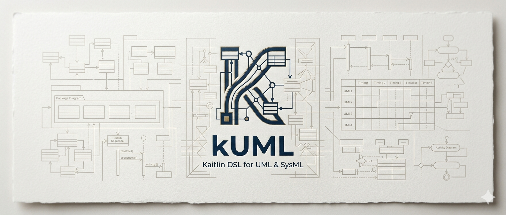

= kUML
:toc:
:toc-placement: preamble
:icons: font



*kUML* is a modelling tool that expresses UML 2.x, SysML 2 and C4 as a
type-safe Kotlin DSL — the first UML tool deliberately designed for the LLM era.

image:https://img.shields.io/maven-central/v/dev.kuml/kuml-core[Maven Central]
image:https://img.shields.io/github/license/kuml-dev/kUML[Apache 2.0]
image:https://img.shields.io/github/actions/workflow/status/kuml-dev/kUML/ci.yml[CI]

== Why kUML?

[.lead]
Every feature in kUML exists in _some_ tool on the market. The specific combination does not exist anywhere else: *type-safe Kotlin DSL · UML 2.x + SysML 2 + C4 as first-class peers · executable behaviour runtime · LLM-first design · Apache 2.0.*

Existing UML tools fall into two categories:

* *Graphical CASE tools* (Enterprise Architect, MagicDraw) — proper modelling, but expensive and not Git-friendly.
* *Text-based diagram tools* (PlantUML, Mermaid) — versionable, but drawing tools only with weak UML support.

kUML closes this gap: a real modelling tool, expressed as Kotlin source code, fully versionable in Git, and built from the ground up for LLM-assisted workflows.

=== The two empty spaces nobody is filling

There are dozens of UML, SysML and architecture tools. None of them fill these two quadrants:

. *No serious modelling tool runs on a typed host language.* There are Python diagram libraries, Java APIs around EMF, custom text grammars by the dozen. There is no mature tool that treats the model as ordinary code in a modern, statically-typed language with IDE refactoring, compile-time checking, and natural build-system integration. kUML uses Kotlin's type-safe builders because they are the cleanest fit available — the principle, not the language choice, is the point.
. *No tool is designed for the LLM era.* PlantUML and Mermaid happen to be LLM-friendly because they have enormous training footprints. That is luck, not design. kUML is built for AI-assisted modelling on purpose: type-safe output that compiles or fails fast, consistent named parameters, an MCP server for agent introspection, a `kuml ai` subcommand, and a benchmark that measures how often LLM-generated models actually validate.

== Quick Start

[source,kotlin]
----
// order-domain.kuml.kts — no imports needed, kUML scripting host provides them
classDiagram(name = "Order Domain") {
    val status = enumOf(name = "OrderStatus") {
        literal(name = "DRAFT")
        literal(name = "CONFIRMED")
        literal(name = "SHIPPED")
        literal(name = "CANCELLED")
    }

    val order = classOf(name = "Order") {
        attribute(name = "id", type = "UUID")
        attribute(name = "status", type = status)        // enum val used as attribute type
        operation(name = "confirm")
        operation(name = "cancel")
    }

    val orderItem = classOf(name = "OrderItem") {
        attribute(name = "quantity", type = "Int")
        attribute(name = "unitPrice", type = "BigDecimal")
    }

    association(source = order, target = orderItem) {
        aggregation = AggregationKind.COMPOSITE
        source { multiplicity(spec = "1") }
        target { multiplicity(spec = "1..*"); role = "items" }
    }
}
----

[source,bash]
----
kuml render order-domain.kuml.kts --format svg
----

== Features

[cols="1,3"]
|===
| Feature | Description

| *Type-safe DSL*
| UML 2.x, SysML 2 and C4 as idiomatic Kotlin — compile-time validation, full IDE support.

| *LLM-native*
| Named parameters, canonical formatter, structured JSON errors, MCP server — designed for reliable LLM code generation.

| *Model Driven Architecture*
| M2M transformations (Design → Implementation → Deployment) and M2T code generation. `kuml transform --transformer uml-to-jpa` generates Kotlin JPA entities from UML class diagrams; additional transformers registered via ServiceLoader.

| *Pure Kotlin metamodel*
| No EMF in the core — `sealed`/`data class` hierarchy only. XMI interop available as optional `kuml-io-emf` module.

| *OCL subset*
| Object Constraint Language constraints directly on the Kotlin model.

| *Built-in UML profiles*
| Five profiles ship with v0.3.0 — *AUTOSAR* (Classic Platform R22-11), JavaEE / Jakarta EE, Spring, OpenAPI, SoaML. Discovered through `ServiceLoader`; add your own without touching the CLI.
|===

== SysML 2 Support

kUML implements all 8 SysML 2 diagram types as first-class peers alongside UML 2.x and C4:

[cols="1,3,1"]
|===
| Diagram type | Description | Simulate

| *BDD* — Block Definition Diagram | System structure, blocks, value properties, associations | —
| *IBD* — Internal Block Diagram | Internal connections and port bindings | —
| *UC* — Use Case Diagram | Actor/use-case relationships in system context | —
| *REQ* — Requirements Diagram | Requirement hierarchy, satisfy/refine/derive traces | —
| *STM* — State Machine Diagram | Hierarchical state machines with guards and effects | ✅ `kuml simulate`
| *ACT* — Activity Diagram | Token-flow activity semantics with partitions (swimlanes) | ✅ `kuml simulate`
| *SEQ* — Sequence Diagram | Lifeline interactions with Combined Fragments | —
| *PAR* — Parametric Diagram | Constraint blocks and parametric equations | —
|===

Notable features added since v0.5.0:

* `kuml simulate` supports SysML 2 *STM* (V2.0.17) and *ACT* (V2.0.18) end-to-end — event-driven state-machine execution and token-flow activity simulation.
* *Combined Fragments* (alt, opt, loop, par, …) in SEQ diagrams (V2.0.15).
* *Activity Partitions / Swimlanes* in ACT diagrams (V2.0.16).
* *Typed expression validation* (`kuml validate --strict`) parses OCL-like guards, effects, and PAR constraints through a typed AST with type inference (V2.0.20b).

== How kUML compares

[cols="3,^1,^1,^1,^1,^1,^1,^1,^1", options="header"]
|===
| Feature
| kUML
| PlantUML
| Mermaid
| D2
| Structurizr
| MagicDraw
| Modelio
| Diagrams (Py)

| UML 2.x (all diagram types)  | ✅ | ⚠️ | ❌ | ❌ | ❌ | ✅ | ✅ | ❌
| SysML 2 first-class          | ✅ | ⚠️ | ❌ | ❌ | ❌ | ⚠️ | ⚠️ | ❌
| C4 first-class               | ✅ | ⚠️ | ⚠️ | ❌ | ✅ | ❌ | ❌ | ⚠️
| Type-safe DSL                | ✅ | ❌ | ❌ | ❌ | ⚠️ | ❌ | ❌ | ⚠️
| Real metamodel               | ✅ | ❌ | ❌ | ❌ | ✅ | ✅ | ✅ | ❌
| OCL constraints              | ✅ | ❌ | ❌ | ❌ | ❌ | ✅ | ✅ | ❌
| AUTOSAR profile (built-in)   | ✅ | ❌ | ❌ | ❌ | ❌ | ⚠️ | ❌ | ❌
| Built-in UML profiles (5)    | ✅ | ❌ | ❌ | ❌ | ❌ | ⚠️ | ⚠️ | ❌
| Code generation (M2T)        | ✅ | ❌ | ❌ | ❌ | ⚠️ | ✅ | ✅ | ❌
| MDA transforms (M2M)         | ✅ | ❌ | ❌ | ❌ | ❌ | ✅ | ⚠️ | ❌
| Executable behaviour simulation | ✅ | ❌ | ❌ | ❌ | ❌ | ◐ | ❌ | ❌
| M2M code generation (transformers) | ✅ | ❌ | ❌ | ❌ | ❌ | ◐ | ◐ | ❌
| Typed expression validation  | ✅ | ❌ | ❌ | ❌ | ❌ | ⚠️ | ❌ | ❌
| Git-native                   | ✅ | ✅ | ✅ | ✅ | ✅ | ❌ | ⚠️ | ✅
| Open source                  | ✅ | ✅ | ✅ | ✅ | ⚠️ | ❌ | ✅ | ✅
| LLM-first design             | ✅ | ❌ | ❌ | ❌ | ❌ | ❌ | ❌ | ❌
| CLI + Gradle + IDE + Web     | ✅ | ⚠️ | ⚠️ | ⚠️ | ⚠️ | ✅ | ✅ | ⚠️
| Beautiful auto-layouts       | ✅ | ❌ | ⚠️ | ✅ | ✅ | ⚠️ | ⚠️ | ✅
|===

✅ present · ⚠️ limited or partial · ◐ proprietary/closed · ❌ absent

=== Where kUML wins

* *Modelling depth, Git-versionability and LLM friendliness in one tool.* Nobody else combines all three.
* *Type-safe DSL as the model substrate* — structurally superior for toolchain integration and AI-assisted generation.
* *UML, SysML and C4 as equal first-class languages.* Every other tool forces you to pick one.
* *Apache 2.0 with a modern stack* (Kotlin, GraalVM Native Image, Compose). No Eclipse legacy.
* *Designed for the LLM era from day one* — structural, not accidental, fitness for AI-assisted modelling.

=== Where we acknowledge the competition

* *PlantUML's ecosystem is enormous* — wikis, IDEs, AsciiDoc tooling, CI plugins. kUML builds bridges (AsciiDoc extension, Gradle plugin, IDE plugins) rather than fighting on volume.
* *Structurizr owns C4 emotionally.* kUML offers Structurizr DSL round-trip — interoperate, don't compete.
* *Mermaid has GitHub-native rendering* — the lowest possible barrier. kUML targets value from step two onward.
* *MagicDraw and Cameo dominate enterprise automotive — but their AUTOSAR support is a paid add-on.* kUML ships the AUTOSAR profile in the box (v0.3.0): `«SoftwareComponent»` with kind/packageName, `«ComInterface»` with version/isService, `«AutosarPort»` with direction (D17 — deliberately not `Port` to avoid the UML metaclass clash), `«Runnable»` with periodic/event-triggered/init/shutdown kinds, and `«BehaviorSpec»` on state machines feeding into `kuml simulate` for trace-based RTE verification.

== CLI Commands

[cols="1,3"]
|===
| Command | Description

| `kuml render`
| Render a `*.kuml.kts` model to SVG or PNG (ELK layout + KumlSvgRenderer / KumlPngRenderer).

| `kuml watch`
| Re-render on file change; 500 ms polling, never exits on script errors.

| `kuml validate`
| Evaluate OCL `constraint(name, body)` declarations; `--output text\|json`, exit code `4` on violations.

| `kuml fmt`
| Idempotent text formatter for `*.kuml.kts`; `--check` mode exits `5` if reformat needed.

| `kuml generate`
| Code generation via plugin (`--plugin kotlin` ships built-in).

| `kuml import`
| Import a diagram from another format (V1: Structurizr DSL → `*.kuml.kts`).

| `kuml markdown`
| Render `kuml`-fenced code blocks in a Markdown file to inline SVG, linked SVG, or linked PNG.

| `kuml completion`
| Emit shell completion scripts for `bash`, `zsh`, or `fish` (Clikt built-in).

| `kuml simulate <script> --events <file>`
| Execute a simulation trace against a UML or SysML 2 behavioural model. Supports STM (state-machine semantics) and ACT (token-flow activity semantics) for both UML and SysML 2. SysML 2 STM added in V2.0.17; SysML 2 ACT added in V2.0.18.

| `kuml transform <script> --transformer <name> --output <dir>`
| M2M transformation: transform a source model to a target artefact. Built-in transformer `uml-to-jpa` generates Kotlin JPA entity files from a UML class diagram. `--list-transformers` lists all registered transformers (discovered via ServiceLoader). Added in V2.0.21.

| `kuml validate --strict <script>`
| Extended validation mode (V2.0.20b): in addition to model consistency checks, parses and type-checks typed expressions — OCL-like guards, effects, and PAR constraints — through a typed AST with type inference.
|===

== Roadmap

[cols="1,4,1"]
|===
| Phase | Scope | Status

| *Phase 0*
| Gradle multimodule setup, Kotlin Scripting host, `diagram{}` DSL entry-point
| ✅ Done

| *Phase 1*
| UML metamodel + UML DSL (5 diagram types: class, sequence, state, component, use-case) +
C4 metamodel + C4 DSL (6 diagram builders) +
Layout API/Bridge/ELK + Kuiver renderer + Theme system (Plain) +
SVG export + PNG export (Batik)
| ✅ Done

| *Phase 2*
| CLI (`render` ✅, `watch` ✅, `validate` ✅, `fmt` ✅, `generate` ✅, `completion` ✅, `import` ✅, `markdown` ✅) +
OCL subset ✅ + Markdown code block ✅ + MCP server ✅ +
`kuml-gen-kotlin` ✅ + LLM Benchmark ✅ (100 % vs. Haiku 4.5) +
GraalVM Native Image 🚧 (deferred V1.1, ADR-0009) +
Maven Central ✅ infra + Homebrew ✅ tap live
| ✅ Done

| *V1.0.1*
| `kuml render` for C4 scripts + SVG Locale-fix +
jlink runtime bundle (self-contained, no JDK dep) +
cleanup: stale Commit-SHAs out of READMEs, DSL-README named-param sweep
| ✅ Done (`v0.1.1`)

| *V1.1*
| All 9 remaining UML 2.x diagram types (object ✅, package ✅, composite-structure ✅,
deployment ✅, profile ✅, activity ✅, communication ✅, timing ✅, interaction-overview ✅) +
profiles, Grid-Layout engine, more themes, more codegen, Structurizr export,
Gradle plugin, AsciiDoc, IDE plugin, `kuml simulate`
| 🚧 In progress — all 9 diagram types shipped

| *V2*
| SysML 2 (all 8 diagram types ✅) + `kuml simulate` for STM + ACT ✅ +
`kuml transform` (uml-to-jpa) ✅ + `kuml validate --strict` typed expressions ✅ +
KerML, reverse engineering, XMI, Web UI, Compose Desktop 🚧
| 🚧 In progress — V2.0.21 on master, unreleased (target v0.6.0)
|===

== Modules

[source]
----
kuml-core/
  kuml-core-model    ✅  Sealed Kotlin metamodel base types
  kuml-core-dsl      ✅  DSL builders: UML (14 diagram types in V1.1) + C4 (6 builders)
  kuml-core-script   ✅  Kotlin Scripting host + KumlScriptDefinition + DiagramExtractor
  kuml-core-ocl      ✅  OCL subset interpreter (navigation, forAll, exists, implies, …)

kuml-metamodel/
  kuml-metamodel-uml ✅  UML 2.x sealed hierarchy + serialization (all V1.1 element types)
  kuml-metamodel-c4  ✅  C4 sealed hierarchy + C4Model

kuml-renderer/
  kuml-layout-api    ✅  Engine-agnostic layout contract (LayoutGraph, LayoutResult, EdgeRoute)
  kuml-layout-bridge ✅  KumlDiagram / C4 → LayoutGraph bridge
  kuml-layout-elk    ✅  ELK 0.11.0 adapter (Sugiyama layered)
  kuml-kuiver        ✅  Compose Multiplatform renderer backend
  kuml-themes-core   ✅  Framework-neutral theme data (KumlColor, KumlTheme, PlainTheme)
  kuml-themes        ✅  Compose adapter for kuml-themes-core

kuml-io/
  kuml-io-svg        ✅  Direct SVG writer from LayoutResult (GraalVM-ready)
  kuml-io-png        ✅  SVG → PNG via Apache Batik 1.19 (Fat-JAR only)

kuml-cli/            ✅  Command-line interface
  render             ✅  kuml render model.kuml.kts [--format svg|png]
  watch              ✅  kuml watch model.kuml.kts  (live-reload, 500ms polling)
  validate           ✅  kuml validate model.kuml.kts --output text|json [--strict]
  fmt                ✅  kuml fmt model.kuml.kts [--check]
  generate           ✅  kuml generate --plugin kotlin model.kuml.kts
  completion         ✅  kuml completion bash|zsh|fish
  import             ✅  kuml import --format structurizr workspace.dsl
  markdown           ✅  kuml markdown --input in.md --output out.md --mode inline|linked-svg|linked-png
  simulate           ✅  kuml simulate model.kuml.kts --events events.json  (UML + SysML 2 STM/ACT)
  transform          ✅  kuml transform model.kuml.kts --transformer uml-to-jpa --output gen/

kuml-mcp/            ✅  MCP server — stdio JSON-RPC 2.0, Protocol 2024-11-05, 5 tools

kuml-codegen/
  kuml-codegen-api   ✅  KumlCodeGenerator plugin interface
  kuml-gen-kotlin    ✅  Built-in Kotlin code generator (data class / interface / enum)

kuml-llm/
  kuml-llm-core      ✅  LlmBackend interface + LlmMockBackend
  kuml-llm-anthropic ✅  Claude API backend via JDK HttpClient (no extra deps)
  kuml-llm-bench     ✅  10-task benchmark suite (kUML/PlantUML/Mermaid, DE+EN)

kuml-docs/
  kuml-markdown     ✅  Markdown ` ```kuml ` block processor (inline/linked SVG/PNG)
kuml-packaging/      🚧  GraalVM Native Image infrastructure done; full native deferred V1.1 (ADR-0009)
----

== Documentation

* link:docs/getting-started.adoc[Getting Started] — install kUML, your first
  class diagram, your first C4 diagram, watch mode, OCL, codegen, Markdown.
* link:docs/diagram-types.adoc[Diagram-Type Reference] — every UML and C4
  diagram type with a runnable snippet.
* link:docs/benchmark/README.adoc[LLM Benchmark Guide] — run the 10-task
  benchmark against the LLM of your choice.
* link:docs/release.md[Release & Distribution] — Maven Central, Homebrew,
  release workflow.
* link:tools/pandoc/README.adoc[Pandoc filter] — generate HTML/PDF with kuml
  diagrams via Pandoc.

== License

Apache 2.0 — see link:LICENSE[LICENSE]
