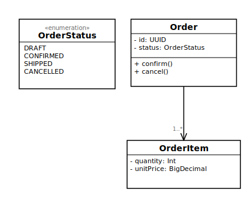

= kUML
:toc:
:toc-placement: preamble
:icons: font

image::docs/images/kuml-banner.png[kUML — Kotlin UML Modelling,link=https://github.com/kuml-dev/kUML]

*Website:* https://kuml.dev · *Handbook:* https://docs.kuml.dev · *Releases:* https://github.com/kuml-dev/kUML/releases

*kUML* is a modelling tool that expresses UML 2.x, SysML 2 and C4 as a
type-safe Kotlin DSL — the first UML tool deliberately designed for the LLM era.

image:https://img.shields.io/maven-central/v/dev.kuml/kuml-core-dsl[Maven Central]
image:https://img.shields.io/github/license/kuml-dev/kUML[Apache 2.0]
image:https://img.shields.io/github/actions/workflow/status/kuml-dev/kUML/ci.yml[CI]

== Why kUML?

[.lead]
Every feature in kUML exists in _some_ tool on the market. The specific combination does not exist anywhere else: *type-safe Kotlin DSL · UML 2.x + SysML 2 + C4 as first-class peers · executable behaviour runtime · LLM-first design · Apache 2.0.*

Existing UML tools fall into two categories:

* *Graphical CASE tools* (Enterprise Architect, MagicDraw) — proper modelling, but expensive and not Git-friendly.
* *Text-based diagram tools* (PlantUML, Mermaid) — versionable, but drawing tools only with weak UML support.

kUML closes this gap: a real modelling tool, expressed as Kotlin source code, fully versionable in Git, and built from the ground up for LLM-assisted workflows.

=== The two empty spaces nobody is filling

There are dozens of UML, SysML and architecture tools. None of them fill these two quadrants:

. *No serious modelling tool runs on a typed host language.* There are Python diagram libraries, Java APIs around EMF, custom text grammars by the dozen. There is no mature tool that treats the model as ordinary code in a modern, statically-typed language with IDE refactoring, compile-time checking, and natural build-system integration. kUML uses Kotlin's type-safe builders because they are the cleanest fit available — the principle, not the language choice, is the point.
. *No tool is designed for the LLM era.* PlantUML and Mermaid happen to be LLM-friendly because they have enormous training footprints. That is luck, not design. kUML is built for AI-assisted modelling on purpose: type-safe output that compiles or fails fast, consistent named parameters, an MCP server for agent introspection, a `kuml ai` subcommand, and a benchmark that measures how often LLM-generated models actually validate.

== Quick Start

[source,kotlin]
----
// order-domain.kuml.kts — no imports needed, kUML scripting host provides them
classDiagram(name = "Order Domain") {
    val status = enumOf(name = "OrderStatus") {
        literal(name = "DRAFT")
        literal(name = "CONFIRMED")
        literal(name = "SHIPPED")
        literal(name = "CANCELLED")
    }

    val order = classOf(name = "Order") {
        attribute(name = "id", type = "UUID")
        attribute(name = "status", type = status)        // enum val used as attribute type
        operation(name = "confirm")
        operation(name = "cancel")
    }

    val orderItem = classOf(name = "OrderItem") {
        attribute(name = "quantity", type = "Int")
        attribute(name = "unitPrice", type = "BigDecimal")
    }

    association(source = order, target = orderItem) {
        aggregation = AggregationKind.COMPOSITE
        source { multiplicity(spec = "1") }
        target { multiplicity(spec = "1..*"); role = "items" }
    }
}
----

[source,bash]
----
kuml render order-domain.kuml.kts --format svg
----

That command produces the diagram below — rendered straight from the script above
with ELK Sugiyama layout and the default Plain theme:

== Installation

[cols="1,3"]
|===
| Method | Command / Link

| *Homebrew* (macOS/Linux)
| `brew install kuml-dev/kuml/kuml`

| *SDKMAN!*
| `sdk install kuml` — supports Linux x86_64, Linux ARM64, macOS, Windows x86_64.

| *Docker*
| `docker pull ghcr.io/kuml-dev/kuml-cli:v0.12.0` — minimal CLI image.

| *Native installers*
| DEB, RPM, DMG, MSI packages built by the `release-installers.yml` CI workflow on every version tag (v0.12.0). Download from the GitHub Releases page.

| *Maven Central* (library modules)
| `implementation("dev.kuml:kuml-core-dsl:0.12.0")` — library modules published to Maven Central.
|===

== Features

[cols="1,3"]
|===
| Feature | Description

| *Type-safe DSL*
| UML 2.x, SysML 2 and C4 as idiomatic Kotlin — compile-time validation, full IDE support.

| *LLM-native*
| Named parameters, canonical formatter, structured JSON errors, MCP server — designed for reliable LLM code generation.

| *Model Driven Architecture*
| M2M transformations (Design → Implementation → Deployment) and M2T code generation. Five built-in transformers: `uml-to-jpa`, `uml-to-rest` (OpenAPI 3.0 YAML), `uml-to-k8s` (Kubernetes manifests), `uml-to-docker` (Dockerfiles), `c4-to-uml`. Additional transformers registered via ServiceLoader.

| *Pure Kotlin metamodel*
| No EMF in the core — `sealed`/`data class` hierarchy only. XMI interop available as optional `kuml-io-emf` module.

| *OCL subset*
| Object Constraint Language constraints directly on the Kotlin model.

| *Built-in UML profiles*
| Five profiles ship with v0.3.0 — *AUTOSAR* (Classic Platform R22-11), JavaEE / Jakarta EE, Spring, OpenAPI, SoaML. Discovered through `ServiceLoader`; add your own without touching the CLI.

| *Web UI (Browser)*
| `kuml serve` starts a Ktor/Netty HTTP server with a CodeMirror 6 editor, 300 ms live SVG preview, theme and layout dropdowns, and SVG / PNG / LaTeX download buttons. No IDE required. (V2.0.34)

| *Snapshot / Restore*
| `StateMachineRuntime.snapshotFull()` and `restoreFrom()` persist and resume complete runtime state — vertices, variable scope, internal event queue, trace. `MigrationPolicy` controls compatibility on model changes: `Reject` · `AcceptIfFingerprintMatches` · `AcceptIfVerticesPresent`. (V2.0.35)

| *Interactive execution (`kuml run`)*
| Drive state machines and activity diagrams interactively. Three adapters: `stdin` (REPL), `mcp` (local REST server for programmatic event injection), `batch` (replay events JSON). Supports `--restore` / `--snapshot-out` for persistent sessions. UML, SysML 2 STM and ACT all supported. (V2.0.38)

| *Reverse Engineering*
| `kuml reverse` reconstructs a UML class diagram from existing source code. Supports Java (via JavaParser, V3.0.7) and Kotlin (via Compiler PSI, V3.0.8). Optional `--transformer` flag passes the recovered model through any registered M2M transformer.

| *XMI Import / Export*
| Full bidirectional XMI (Eclipse EMF/UML2) via `kuml-io-emf`. Supports Class, Interface, Enum, Association, Generalization, InterfaceRealization, Dependency. Compatible with Enterprise Architect, Papyrus, and MagicDraw. (V3.0.15–17)

| *AI Assistant*
| `kuml-ai` module embeds a Koog-based multi-LLM agent (OpenAI, Anthropic, Google, DeepSeek, OpenRouter, Ollama) with an AI panel in the Desktop app and patch-preview workflow. (V3.0.22–23)
|===

== UML 2.x Support

kUML implements all 14 UML 2.x diagram types as first-class peers alongside SysML 2 and C4:

[cols="1,3,1"]
|===
| Diagram type | Description | Simulate

| *Class Diagram*
| Classes, interfaces, enumerations, associations, generalisations, dependencies, realisations
| —

| *Object Diagram*
| Snapshots of instance-level object graphs and slot values
| —

| *Package Diagram*
| Package hierarchy, imports, merges, and namespace dependencies
| —

| *Component Diagram*
| Logical components, provided/required interfaces, and connectors
| —

| *Composite Structure Diagram*
| Internal part/port structure of a classifier and its connectors
| —

| *Deployment Diagram*
| Node topology, artefact deployment, and communication paths
| —

| *Profile Diagram*
| Metaclass extensions, stereotypes, tagged values, and constraints
| —

| *Use Case Diagram*
| Actor/use-case relationships, include/extend associations, and system boundaries
| —

| *Activity Diagram*
| Token-flow activity semantics, partitions (swimlanes), decision and fork/join nodes
| ✅ `kuml simulate`

| *State Machine Diagram*
| Hierarchical state machines with guards, effects, internal transitions, and history pseudo-states
| ✅ `kuml simulate`

| *Sequence Diagram*
| Lifeline interactions, synchronous/asynchronous messages, and Combined Fragments (alt/opt/loop/par)
| —

| *Communication Diagram*
| Object interactions with numbered message flows along associations
| —

| *Timing Diagram*
| State/condition timelines across multiple lifelines with timing constraints
| —

| *Interaction Overview Diagram*
| Control flow overview combining activity and sequence diagram fragments
| —
|===

== SysML 2 Support

kUML implements all 8 SysML 2 diagram types as first-class peers alongside UML 2.x and C4:

[cols="1,3,1"]
|===
| Diagram type | Description | Simulate

| *BDD* — Block Definition Diagram | System structure, blocks, value properties, associations | —
| *IBD* — Internal Block Diagram | Internal connections and port bindings | —
| *UC* — Use Case Diagram | Actor/use-case relationships in system context | —
| *REQ* — Requirements Diagram | Requirement hierarchy, satisfy/refine/derive traces | —
| *STM* — State Machine Diagram | Hierarchical state machines with guards and effects | ✅ `kuml simulate`
| *ACT* — Activity Diagram | Token-flow activity semantics with partitions (swimlanes) | ✅ `kuml simulate`
| *SEQ* — Sequence Diagram | Lifeline interactions with Combined Fragments | —
| *PAR* — Parametric Diagram | Constraint blocks and parametric equations | —
|===

Notable features added since v0.5.0:

* `kuml simulate` supports SysML 2 *STM* (V2.0.17) and *ACT* (V2.0.18) end-to-end — event-driven state-machine execution and token-flow activity simulation.
* *Combined Fragments* (alt, opt, loop, par, …) in SEQ diagrams (V2.0.15).
* *Activity Partitions / Swimlanes* in ACT diagrams (V2.0.16).
* *Typed expression validation* (`kuml validate --strict`) parses OCL-like guards, effects, and PAR constraints through a typed AST with type inference (V2.0.20b).
* *Web UI LaTeX download* — `POST /api/render` in `kuml serve` accepts `format = "latex"` for all 10 diagram types, including all 8 SysML 2 kinds (V2.0.36).
* *Snapshot/Restore for SysML 2* — `snapshotFull` / `restoreFrom` preserve complete runtime state for SysML 2 STM and ACT instances (V2.0.35).
* *`kuml run` SysML 2 support* — all three adapters (stdin / mcp / batch) accept SysML 2 STM and ACT scripts (V2.0.38).

== C4 Support

kUML implements all 6 C4 diagram types as first-class peers alongside UML 2.x and SysML 2:

[cols="1,3"]
|===
| Diagram type | Description

| *Context Diagram*
| System boundaries, external actors (persons and external systems), and their relationships

| *Container Diagram*
| Applications, services, and databases within a system boundary and their interactions

| *Component Diagram*
| Internal components within a container and their dependencies

| *Deployment Diagram*
| Deployment topology with nodes, infrastructure elements, and container instances

| *Dynamic Diagram*
| Numbered interaction sequences between persons, systems, containers, or components

| *Landscape Diagram*
| Multi-system enterprise overview — persons and systems across organisational boundaries
|===

Structurizr DSL round-trip is supported via `kuml import --format structurizr` and `kuml export --format structurizr`, allowing interoperability with existing Structurizr workspaces.

== How kUML compares

[cols="3,^1,^1,^1,^1,^1,^1,^1,^1", options="header"]
|===
| Feature
| kUML
| PlantUML
| Mermaid
| D2
| Structurizr
| MagicDraw
| Modelio
| Diagrams (Py)

| UML 2.x (all diagram types)  | ✅ | ⚠️ | ❌ | ❌ | ❌ | ✅ | ✅ | ❌
| SysML 2 first-class          | ✅ | ⚠️ | ❌ | ❌ | ❌ | ⚠️ | ⚠️ | ❌
| C4 first-class               | ✅ | ⚠️ | ⚠️ | ❌ | ✅ | ❌ | ❌ | ⚠️
| Type-safe DSL                | ✅ | ❌ | ❌ | ❌ | ⚠️ | ❌ | ❌ | ⚠️
| Real metamodel               | ✅ | ❌ | ❌ | ❌ | ✅ | ✅ | ✅ | ❌
| OCL constraints              | ✅ | ❌ | ❌ | ❌ | ❌ | ✅ | ✅ | ❌
| AUTOSAR profile (built-in)   | ✅ | ❌ | ❌ | ❌ | ❌ | ⚠️ | ❌ | ❌
| Built-in UML profiles (5)    | ✅ | ❌ | ❌ | ❌ | ❌ | ⚠️ | ⚠️ | ❌
| Code generation (M2T)        | ✅ | ❌ | ❌ | ❌ | ⚠️ | ✅ | ✅ | ❌
| MDA transforms (M2M)         | ✅ | ❌ | ❌ | ❌ | ❌ | ✅ | ⚠️ | ❌
| Executable behaviour simulation | ✅ | ❌ | ❌ | ❌ | ❌ | ◐ | ❌ | ❌
| M2M code generation (transformers) | ✅ | ❌ | ❌ | ❌ | ❌ | ◐ | ◐ | ❌
| Typed expression validation  | ✅ | ❌ | ❌ | ❌ | ❌ | ⚠️ | ❌ | ❌
| Git-native                   | ✅ | ✅ | ✅ | ✅ | ✅ | ❌ | ⚠️ | ✅
| Open source                  | ✅ | ✅ | ✅ | ✅ | ⚠️ | ❌ | ✅ | ✅
| LLM-first design             | ✅ | ❌ | ❌ | ❌ | ❌ | ❌ | ❌ | ❌
| CLI + Gradle + IDE + Web     | ✅ | ⚠️ | ⚠️ | ⚠️ | ⚠️ | ✅ | ✅ | ⚠️
| Beautiful auto-layouts       | ✅ | ❌ | ⚠️ | ✅ | ✅ | ⚠️ | ⚠️ | ✅
| Grid layout (opt-in, experimental)    | ✅ | ❌ | ❌ | ⚠️ | ❌ | ⚠️ | ⚠️ | ❌
| M2M code generation (5 transformers)  | ✅ | ❌ | ❌ | ❌ | ❌ | ◐ | ◐ | ❌
| Native installers (DEB/RPM/DMG/MSI/Docker) | ✅ | ❌ | ❌ | ❌ | ❌ | ✅ | ◐ | ❌
|===

✅ present · ⚠️ limited or partial · ◐ proprietary/closed · ❌ absent

=== Where kUML wins

* *Modelling depth, Git-versionability and LLM friendliness in one tool.* Nobody else combines all three.
* *Type-safe DSL as the model substrate* — structurally superior for toolchain integration and AI-assisted generation.
* *UML, SysML and C4 as equal first-class languages.* Every other tool forces you to pick one.
* *Apache 2.0 with a modern stack* (Kotlin, GraalVM Native Image, Compose). No Eclipse legacy.
* *Designed for the LLM era from day one* — structural, not accidental, fitness for AI-assisted modelling.

=== Where we acknowledge the competition

* *PlantUML's ecosystem is enormous* — wikis, IDEs, AsciiDoc tooling, CI plugins. kUML builds bridges (AsciiDoc extension, Gradle plugin, IDE plugins) rather than fighting on volume.
* *Structurizr owns C4 emotionally.* kUML offers Structurizr DSL round-trip — interoperate, don't compete.
* *Mermaid has GitHub-native rendering* — the lowest possible barrier. kUML targets value from step two onward.
* *MagicDraw and Cameo dominate enterprise automotive — but their AUTOSAR support is a paid add-on.* kUML ships the AUTOSAR profile in the box (v0.3.0): `«SoftwareComponent»` with kind/packageName, `«ComInterface»` with version/isService, `«AutosarPort»` with direction (D17 — deliberately not `Port` to avoid the UML metaclass clash), `«Runnable»` with periodic/event-triggered/init/shutdown kinds, and `«BehaviorSpec»` on state machines feeding into `kuml simulate` for trace-based RTE verification.

== CLI Commands

[cols="1,3"]
|===
| Command | Description

| `kuml render`
| Render a `*.kuml.kts` model to SVG or PNG (ELK layout + KumlSvgRenderer / KumlPngRenderer).

| `kuml watch`
| Re-render on file change; 500 ms polling, never exits on script errors.

| `kuml validate`
| Evaluate OCL `constraint(name, body)` declarations; `--output text\|json`, exit code `4` on violations.

| `kuml fmt`
| Idempotent text formatter for `*.kuml.kts`; `--check` mode exits `5` if reformat needed.

| `kuml generate`
| Code generation via plugin (`--plugin kotlin\|java\|sql` built-in).

| `kuml import`
| Import a diagram from another format: `--format structurizr` (Structurizr DSL → `*.kuml.kts`) or `--format xmi` (XMI/EMF → `*.kuml.kts`).

| `kuml export`
| Export a model to another format: `--format structurizr` (Structurizr DSL) or `--format xmi` (XMI/EMF).

| `kuml reverse`
| Reconstruct a UML class diagram from existing source code. `--lang java\|kotlin\|auto` selects the parser engine (JavaParser for Java, Kotlin Compiler PSI for Kotlin). Optional `--transformer <id>` passes the recovered model through a registered M2M transformer. (V3.0.9)

| `kuml markdown`
| Render `kuml`-fenced code blocks in a Markdown file to inline SVG, linked SVG, or linked PNG.

| `kuml completion`
| Emit shell completion scripts for `bash`, `zsh`, or `fish` (Clikt built-in).

| `kuml simulate <script> --events <file>`
| Execute a simulation trace against a UML or SysML 2 behavioural model. Supports STM (state-machine semantics) and ACT (token-flow activity semantics) for both UML and SysML 2. SysML 2 STM added in V2.0.17; SysML 2 ACT added in V2.0.18.

| `kuml transform <script> --transformer <id> --output <dir>`
| M2M transformation: transform a source model to a target artefact. Five built-in transformers: `uml-to-jpa`, `uml-to-rest` (OpenAPI 3.0 YAML), `uml-to-k8s` (Kubernetes manifests), `uml-to-docker` (Dockerfiles), `c4-to-uml`. `--list-transformers` lists all registered transformers (discovered via ServiceLoader). V2.0.21–V2.0.25.

| `kuml render <script> --layout=grid\|elk\|auto`
| Override the per-diagram layout engine. `elk` (ELK Sugiyama layered) is the default for all diagram types. `grid` opts in to the experimental `kuml.grid` engine. Added in V2.0.26.

| `kuml render <script> --latex-standalone`
| Produce a self-contained compilable `.tex` file (previously the LaTeX output was library-only). Added in V2.0.31.

| `kuml validate <script> --no-check-structure`
| Skip structural checks (duplicate IDs, circular inheritance, dangling references). By default `kuml validate` now includes these checks in addition to OCL evaluation. Added in V2.0.31.

| `kuml validate --strict <script>`
| Extended validation mode (V2.0.20b): in addition to model consistency checks, parses and type-checks typed expressions — OCL-like guards, effects, and PAR constraints — through a typed AST with type inference.

| `kuml serve [--port N] [--host H]`
| Start the kUML Web UI — a Ktor/Netty HTTP server with a CodeMirror 6 browser editor, 300 ms live SVG preview, theme and layout dropdowns, and SVG / PNG / LaTeX download buttons. Added in V2.0.34.

| `kuml run <script> [--adapter stdin\|mcp\|batch]`
| Interactive and live-mirror execution of state machines and activity diagrams. `--adapter stdin` (default) — interactive REPL with built-in `snapshot` / `status` / `quit` commands. `--adapter mcp` — starts a local REST server (`POST /run/event`, `GET /run/snapshot`, `POST /run/patch`, `POST /run/stop`, `GET /run/health`). `--adapter batch` — replays `--events <file.json>`, writes trace via `--out`. `--restore <snapshot.json>` resumes from a prior snapshot; `--snapshot-out <path>` persists on exit. Added in V2.0.38.

| `kuml profile list\|show\|validate`
| List all registered profiles, inspect a specific profile's stereotypes and tagged values, or validate a model against a profile's constraints.

| `kuml update check` / `kuml update notes`
| Poll GitHub Releases for the latest version (`check`) or display release notes for a specific version (`notes`). Added in V2.0.1.

| `kuml version`
| Print the installed kUML version and build metadata.
|===

== Roadmap

[cols="1,4,1"]
|===
| Phase | Scope | Status

| *Phase 0*
| Gradle multimodule setup, Kotlin Scripting host, `diagram{}` DSL entry-point
| ✅ Done

| *Phase 1*
| UML metamodel + UML DSL (5 diagram types: class, sequence, state, component, use-case) +
C4 metamodel + C4 DSL (6 diagram builders) +
Layout API/Bridge/ELK + Kuiver renderer + Theme system (Plain) +
SVG export + PNG export (Batik)
| ✅ Done

| *Phase 2*
| CLI (`render` ✅, `watch` ✅, `validate` ✅, `fmt` ✅, `generate` ✅, `completion` ✅, `import` ✅, `markdown` ✅) +
OCL subset ✅ + Markdown code block ✅ + MCP server ✅ +
`kuml-gen-kotlin` ✅ + LLM Benchmark ✅ (100 % vs. Haiku 4.5) +
GraalVM Native Image 🚧 (deferred V1.1, ADR-0009) +
Maven Central ✅ infra + Homebrew ✅ tap live
| ✅ Done

| *V1.0.1*
| `kuml render` for C4 scripts + SVG Locale-fix +
jlink runtime bundle (self-contained, no JDK dep) +
cleanup: stale Commit-SHAs out of READMEs, DSL-README named-param sweep
| ✅ Done (`v0.1.1`)

| *V1.1*
| All 9 remaining UML 2.x diagram types (object ✅, package ✅, composite-structure ✅,
deployment ✅, profile ✅, activity ✅, communication ✅, timing ✅, interaction-overview ✅) +
profiles ✅, Grid-Layout engine ✅, 4 themes ✅, codegen Java+SQL ✅, Structurizr export ✅,
Gradle plugin ✅, AsciiDoc ✅, Antora handbook ✅, JetBrains plugin ✅, VS Code plugin ✅, `kuml simulate` ✅
| ✅ Done (`v0.3.0`)

| *V2*
| SysML 2 (all 8 diagram types ✅) + `kuml simulate` for STM + ACT ✅ +
`kuml transform` (5 transformers: uml-to-jpa, uml-to-rest, uml-to-k8s, uml-to-docker, c4-to-uml) ✅ +
`kuml validate --strict` typed expressions ✅ +
`kuml render --layout=grid\|elk\|auto` (elk default, grid opt-in) ✅ +
JetBrains plugin — annotator, quick fixes, live SVG preview, structure view, code folding ✅ +
`kuml-runtime-mcp` (5 runtime tools) ✅ +
Web UI: `kuml serve` Ktor/Netty + CodeMirror 6 SPA + SVG/PNG/LaTeX ✅ +
Snapshot/Restore + MigrationPolicy ✅ +
`kuml run` (stdin/mcp/batch adapters) ✅ +
Distribution Phase 1: DEB/RPM/DMG/MSI + Docker + SDKMAN! Windows/ARM64 ✅
| ✅ Done (`v0.4.0–v0.11.0`)

| *V3.0*
| `kuml reverse` — Java→UML (JavaParser, V3.0.7) + Kotlin→UML (Compiler PSI, V3.0.8) ✅ +
`kuml-desktop` — file I/O, MRU recent-files, Plugin Manager UI, jpackage distribution (DMG/MSI/DEB/RPM) ✅ +
AI assistant — Koog multi-LLM agent (OpenAI, Anthropic, Google, DeepSeek, OpenRouter, Ollama),
AI panel in Desktop app, patch-preview workflow ✅ +
`kuml-io-emf` — XMI import/export (EA, Papyrus, MagicDraw interop), Class/Interface/Enum/Association/
Generalization/InterfaceRealization/Dependency ✅ +
`kuml-runtime-trace` — OTLP-JSON trace export ✅ +
`kuml-runtime-sandbox` — EffectExecutor, TimeLimitedGuardEvaluator, SandboxValidator ✅ +
`kuml-ai-tools` — @Tool DSL builder suite + MCP bridge + AgentEditingContext ✅ +
`kuml-core-config` — kuml.config.kts DSL + Script Host ✅ +
`kuml-core-expr` — Typed Expression AST + Parser + Evaluator ✅ +
`kuml-metamodel-kerml` + `kuml-metamodel-sysml2` — KerML foundation + SysML 2 sealed hierarchy ✅ +
`kuml-widget-compose` — Executable behaviour widget (Compose Multiplatform) ✅ +
`kuml-vault-examples-tests` — 31 CI smoke tests rendering all vault examples ✅
| ✅ Done (`v0.12.0`)

| *V3.x*
| Plugin ecosystem — `kuml-plugin-api` marketplace SPI, plugin registry, CLI plugin manager, Desktop plugin manager +
AUTOSAR ARXML import/export (`kuml-io-arxml`) +
Chain-backed models — `kuml-runtime-chain-api` + EVM adapter
| 🗓 Planned
|===

== Modules

[source]
----
kuml-core/
  kuml-core-model    ✅  Sealed Kotlin metamodel base types
  kuml-core-dsl      ✅  DSL builders: UML (14 diagram types) + C4 (6 builders) + SysML 2 (8 diagram types)
  kuml-core-script   ✅  Kotlin Scripting host + KumlScriptDefinition + DiagramExtractor
  kuml-core-config   ✅  kuml.config.kts DSL + Script Host (V1.1.3)
  kuml-core-ocl      ✅  OCL subset interpreter
  kuml-core-expr     ✅  Typed Expression AST + Parser + Evaluator (V2.0.20a)

kuml-metamodel/
  kuml-metamodel-uml    ✅  UML 2.x sealed hierarchy (all 14 diagram types)
  kuml-metamodel-c4     ✅  C4 sealed hierarchy + C4Model (all 6 diagram types)
  kuml-metamodel-kerml  ✅  KerML foundation for SysML 2 (V2.0.3)
  kuml-metamodel-sysml2 ✅  SysML 2 on KerML (all 8 diagram types, V2.0.3+)

kuml-renderer/
  kuml-layout-api    ✅  Engine-agnostic layout contract (LayoutGraph, LayoutResult, EdgeRoute)
  kuml-layout-bridge ✅  KumlDiagram / C4 / SysML 2 → LayoutGraph bridge
  kuml-layout-elk    ✅  ELK 0.11.0 adapter (Sugiyama layered, default)
  kuml-layout-grid   ✅  Pure-Kotlin grid layout engine (V1.1.12)
  kuml-kuiver        ✅  Compose Multiplatform renderer backend
  kuml-themes-core   ✅  Framework-neutral theme data
  kuml-themes        ✅  4 themes: Plain, kUML, Elegant, Playful

kuml-io/
  kuml-io-svg        ✅  Direct SVG writer (GraalVM-ready)
  kuml-io-png        ✅  SVG → PNG via Apache Batik 1.19 (Fat-JAR only)
  kuml-io-json       ✅  Model persistence via kotlinx.serialization
  kuml-io-latex      ✅  LaTeX / TikZ export
  kuml-io-emf        ✅  XMI import/export via Eclipse EMF/UML2 (JVM-only, V3.0.15–17)
                         kuml import --format xmi / kuml export --format xmi
                         Full bidirectional: Class, Interface, Enum, Association,
                         Generalization, InterfaceRealization, Dependency

kuml-codegen/
  kuml-codegen-api          ✅  KumlCodeGenerator plugin interface (ServiceLoader SPI)
  kuml-codegen-m2m          ✅  M2M Transformer Foundation: KumlTransformer, rule-DSL,
                                5 built-in transformers (V2.0.21+)
  kuml-gen-kotlin           ✅  Kotlin code generator (data class / interface / enum)
  kuml-gen-java             ✅  Java POJO / Records / Lombok generator
  kuml-gen-sql              ✅  SQL DDL generator (Postgres / MySQL / H2 / SQLite)
  kuml-codegen-reverse-api  ✅  Language-agnostic KumlReverseEngine interface (V3.0.7)
  kuml-codegen-reverse-java ✅  JavaParser-based Java → UML engine (V3.0.7)
  kuml-codegen-reverse-kotlin ✅ Kotlin Compiler PSI → UML engine (V3.0.8)

kuml-runtime/
  kuml-runtime-core    ✅  StateMachineRuntime + ActivityRuntime + Snapshot/Restore + MigrationPolicy
  kuml-runtime-trace   ✅  Trace replay + OTLP-JSON export (V2.0.39)
  kuml-runtime-sandbox ✅  Sandbox guarantees: EffectExecutor, TimeLimitedGuardEvaluator,
                           SandboxValidator (V2.0.40)

kuml-mcp/              ✅  MCP server — stdio JSON-RPC 2.0
                           Authoring tools (5): kuml.diagram.*
                           Runtime tools (5): kuml.run.start / event / snapshot / patch / stop

kuml-web/              ✅  Browser-based editing environment (V2.0.34)
                           Ktor/Netty HTTP + CodeMirror 6 SPA + SVG/PNG/LaTeX REST API

kuml-widget/
  kuml-widget-compose  ✅  Executable behaviour widget (Compose Multiplatform, V2.0.43)

kuml-desktop/          ✅  Compose Desktop app (V3.0.10–14)
                           Editor (RSyntaxTextArea) + Live preview (JSVGCanvas/Batik)
                           File I/O + MRU recent-files + persistent settings
                           Plugin Manager UI (ServiceLoader introspection)
                           jpackage distribution: DMG / MSI / DEB / RPM

kuml-ai/
  kuml-ai-core         ✅  Koog-based AI agent: Multi-LLM executor (OpenAI, Anthropic,
                           Google, DeepSeek, OpenRouter, Ollama), API key vault (V3.0.22)
  kuml-ai-tools        ✅  @Tool DSL builder suite + MCP bridge + AgentEditingContext (V3.0.23)

kuml-cli/              ✅  Command-line interface (all commands above)

kuml-gradle/           ✅  Gradle plugin (plugin ID: dev.kuml)
                           Tasks: kumlRender, kumlGenerate, kumlValidate (@CacheableTask)

kuml-jetbrains/        ✅  JetBrains IDE plugin (IntelliJ IDEA 2024.3+)
                           Annotator + 4 quick fixes, live SVG preview, structure view, code folding

kuml-vscode-plugin/    ✅  VS Code extension
                           TextMate grammar + DSL snippets + kUML: Render to SVG

kuml-llm/
  kuml-llm-core        ✅  LlmBackend interface
  kuml-llm-anthropic   ✅  Claude API backend
  kuml-llm-bench       ✅  10-task benchmark suite

kuml-docs/
  kuml-markdown        ✅  Markdown kuml code block processor
  kuml-asciidoc        ✅  AsciiDoc [kuml] block macro (Antora-compatible)

kuml-profile/
  kuml-profile-api     ✅  KumlProfile SPI + KumlStereotypeApplication
  kuml-profile-autosar ✅  AUTOSAR Classic R22-11 profile
  kuml-profile-javaee  ✅  JavaEE / Jakarta EE profile
  kuml-profile-spring  ✅  Spring Framework profile
  kuml-profile-openapi ✅  OpenAPI 3.x profile
  kuml-profile-soaml   ✅  SoaML profile

kuml-packaging/        ✅  GraalVM Native Image + DEB/RPM/DMG/MSI + Docker + SDKMAN!

kuml-tests/
  kuml-dsl-tests              ✅  DSL unit tests
  kuml-renderer-tests         ✅  SVG snapshot tests
  kuml-codegen-tests          ✅  Codegen tests
  kuml-cli-tests              ✅  CLI end-to-end tests
  kuml-vault-examples-tests   ✅  31 CI smoke tests: render all 30 vault examples (V3.0.x)
  kuml-mcp-tests, kuml-ocl-tests, kuml-llm-tests  ✅
----

== Documentation

* https://docs.kuml.dev[*Handbook*] (online) — full DSL reference, diagram
  types, CLI, Gradle plugin, MDA, plugin API. Built with Antora from
  `docs/handbook/` on every push to `master`.
* link:docs/getting-started.adoc[Getting Started] — install kUML, your first
  class diagram, your first C4 diagram, watch mode, OCL, codegen, Markdown.
* link:docs/diagram-types.adoc[Diagram-Type Reference] — every UML and C4
  diagram type with a runnable snippet.
* link:docs/benchmark/README.adoc[LLM Benchmark Guide] — run the 10-task
  benchmark against the LLM of your choice.
* link:docs/release.md[Release & Distribution] — Maven Central, Homebrew,
  release workflow.
* link:tools/pandoc/README.adoc[Pandoc filter] — generate HTML/PDF with kuml
  diagrams via Pandoc.

== License

Apache 2.0 — see link:LICENSE[LICENSE]
