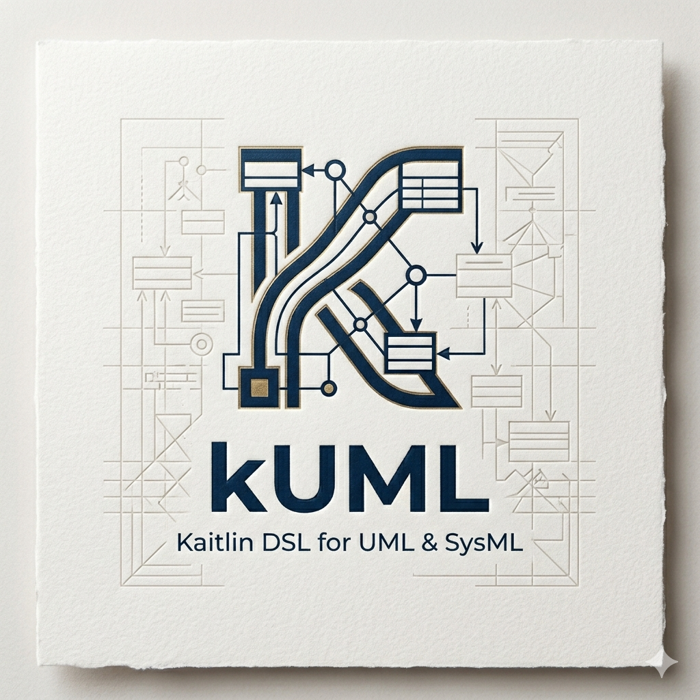

= kuml-metamodel-uml
:toc:

 *kuml-metamodel-uml*

Pure Kotlin sealed-class hierarchy for UML 2.x — the metamodel that backs all
V1 UML diagram types (CLASS, SEQUENCE, STATE, COMPONENT, USE_CASE).

All types are `@Serializable` via `kotlinx.serialization`. No EMF, no reflection,
no code generation.

== Element Hierarchy

[source]
----
UmlElement (sealed)
├── UmlNamedElement (sealed)
│   ├── UmlClassifier (sealed)
│   │   ├── UmlClass
│   │   ├── UmlInterface
│   │   ├── UmlEnumeration
│   │   ├── UmlActor
│   │   ├── UmlUseCase
│   │   └── UmlComponent
│   ├── UmlProperty
│   ├── UmlOperation
│   ├── UmlParameter
│   ├── UmlConstraint
│   ├── UmlEnumerationLiteral
│   ├── UmlPackage
│   ├── UmlPort
│   ├── UmlLifeline
│   ├── UmlMessage
│   ├── UmlCombinedFragment
│   ├── UmlInteractionOperand
│   ├── UmlStateMachine
│   ├── UmlVertex (sealed)
│   │   ├── UmlState
│   │   ├── UmlPseudostate
│   │   └── UmlFinalState
│   ├── UmlTransition
│   ├── UmlInteraction
│   ├── UmlUseCaseSubject
│   ├── UmlInstanceSpecification          ← V1.1 (object diagram)
│   ├── UmlNode                            ← V1.1 (deployment)
│   ├── UmlArtifact                        ← V1.1 (deployment)
│   ├── UmlStereotype                      ← V1.1 (profile)
│   ├── UmlActivityNode                    ← V1.1 (activity, enum-kinded)
│   ├── UmlTimingLifeline                  ← V1.1 (timing)
│   └── UmlInteractionOverviewFrame        ← V1.1 (interaction overview)
└── UmlRelationship (sealed)
    ├── UmlAssociation
    ├── UmlGeneralization
    ├── UmlInterfaceRealization
    ├── UmlDependency
    ├── UmlInclude
    ├── UmlExtend
    ├── UmlConnector
    ├── UmlLink                              ← V1.1 (object diagram, communication)
    └── UmlActivityEdge                      ← V1.1 (activity, interaction overview)
----

== ID Strategy

Element IDs are derived deterministically from the qualified namespace path,
using `::` as separator (UML convention).

[cols="1,2"]
|===
| Element | Example ID

| Root class | `Order`
| Packaged class | `domain::Order`
| Attribute | `domain::Order::id`
| Operation (no overload) | `domain::Order::confirm()`
| Operation (overloaded) | `domain::Order::find(Long,String)`
| Enum literal | `domain::OrderStatus::DRAFT`
| Transition | `OrderSM::t::DRAFT->CONFIRMED`
| Association | `assoc::domain::Order-->domain::Item`
| Generalization | `gen::Dog-|>Animal`
|===

All ID helpers live in `dev.kuml.uml.ids.UmlIds`.
Use the DSL in `kuml-core-dsl` to build models — IDs are derived automatically.

== Serialization

Every type in this module carries `@Serializable` from `kotlinx.serialization`.
The sealed hierarchy uses a `type` discriminator field for polymorphic JSON:

[source,json]
----
[
  { "type": "dev.kuml.uml.UmlClass", "id": "Order", "name": "Order", ... },
  { "type": "dev.kuml.uml.UmlGeneralization", "id": "gen::Dog-|>Animal", ... }
]
----

== Installation

[source,kotlin]
----
dependencies {
    implementation("dev.kuml:kuml-metamodel-uml:0.24.3")
}
----

== License

Apache 2.0 — see link:../../LICENSE[LICENSE]
